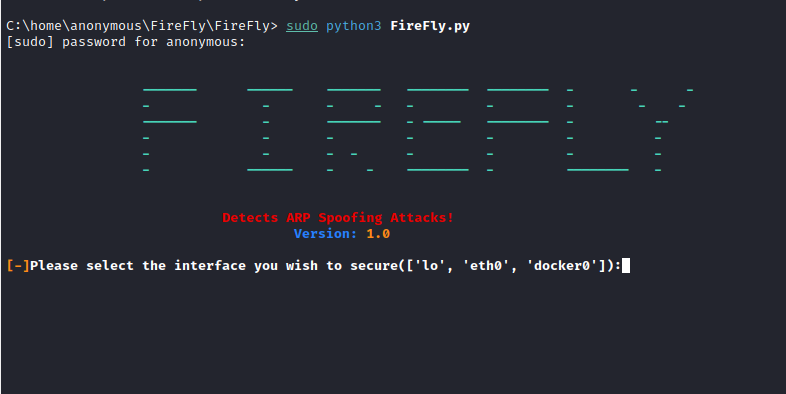

# FireFly 

FireFly is a security application that uses a combination of simple yet strategic methodologies and powerful techniques to detect ARP based attacks. Using passive modules FireFly detects hackers inside your network.

# Installation
After Cloning, run the following commands:

$ sudo python3 setup.py

$ sudo python3 FireFly.py

